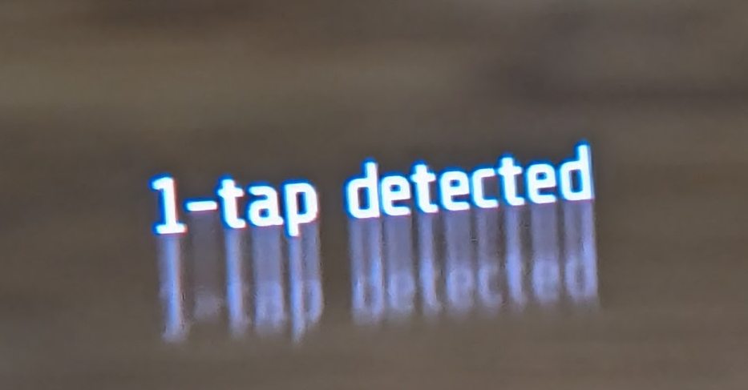
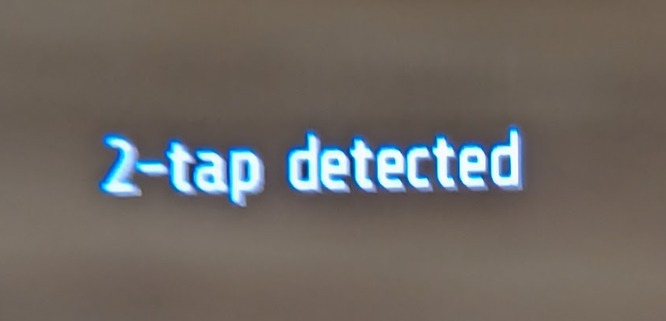
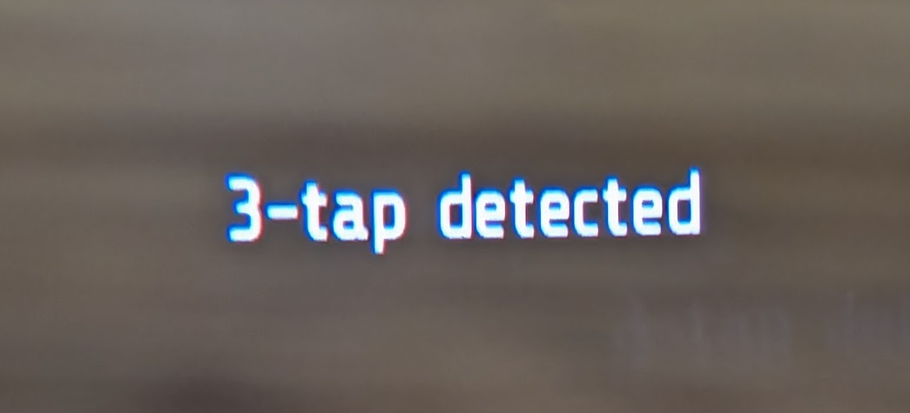
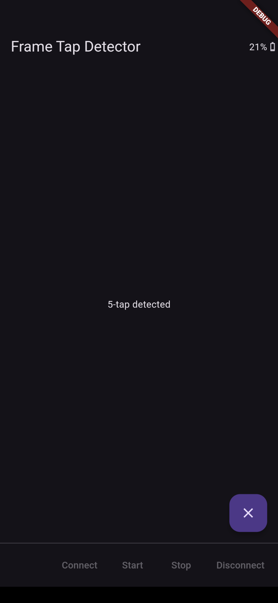

# Frame Tap Detector

App demonstrating subscription to tap detection on Brilliant Labs Frame. Multi-taps are passed through and recognized in the phone app (single tap, double tap, up to any number). Debouncing input noise (extra taps very close in time to other taps, but unintended) also occurs in the phone app.

An app could use N multi-taps to distinguish between user intents, e.g. voice query, voice plus photo query, standard photo query no voice prompt, etc.

### Frameshots

### Screenshots

### Architecture
